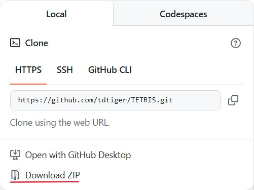

# TETRIS
JavaScriptの練習用に作成したテトリスです．
Tスピンみたいなテクニカルな奴らには対応してませんが，ホールドとか，得点の計算方法とかはできるだけ似せたつもりです．

## プレビュー(GIF)


なんか見切れてないか？？

## デモ
GitHubPagesを利用したデモプレイです．
スマートフォン，PC双方に対応していますが，スマートフォンは操作性が悪かったり，反応が鈍かったりという課題があるため，PCでのプレイをお勧めします．

https://tdtiger.github.io/TETRIS/

## 参考
以下のリンク先にある，再生リストの動画を参考にさせていただきました．

https://www.youtube.com/playlist?list=PLa3BDwShqOrThKoaWauNo8EKZda4pat7Z

## 操作方法

| 動作 | キー |
| ---- | ---- |
| 移動 | `←` `↓` `→` |
| 高速落下 | `↑` |
| 左回転 | `z` |
| 右回転 | `x` |
| ホールド | `Space` |
| 初期化 | `Enter` |
| 一時停止 | `p` |
| BGMの再生/停止 | `m` |

※効果音等はgitignoreされています．各自でダウンロードし，musicフォルダ内への保存をお願いします．

| 用途 | 製作者 | 音源名 | リンク | プログラム内での名称 |
| ---- | ----- | ------ | ----- | ------------------ |
| ミノ消滅音 | 魔王魂 | システム45 | https://maou.audio/se_system45/ | `maou_se_system45.mp3` |
| BGM | 魔王魂 | 8bit24 | https://maou.audio/bgm_8bit24/ | `maou_bgm_8bit24.mp3` |


## 実行までの流れ
初めに，以下のコマンドを入力し，このリポジトリをcloneします．
``` bash
git clone https://github.com/tdtiger/TETRIS.git
```
あるいは，"Download Zip"からZipファイルをダウンロードし，解凍します．
<center>



</center>

ファイルの階層構造を維持したまま，`index.html`を開くと，ゲームが開始されます．

<!-- <h2>更新履歴</h2>
6/3<br>
左回転実装
<br>
6/7<br>
次のミノが見られるように<br>
ホールド機能実装(不具合あり)<br>
一部関数統合
<br>
6/10<br>
ゲームスピード更新のための関数作成
<br>
6/12<br>
UIをやや調整<br>
初回ホールド時にNextが更新されない不具合を修正<br>
キャンバス内の文字の大きさを修正<br>
操作方法を表示
<br>
6/18<br>
ボタンをinputタグによるものから画像に変更<br>
得点の計算方法，更新方法を変更
<br>
6/21<br>
ホールド機能の不具合を修正<br>
9/5<br>
落下速度の更新，一時停止機能の不具合修正<br>
10/23<br>
落下速度の表示を小数点3桁までに変更，コメントの修正 -->
